```mermaid
graph TB
    subgraph "Client Layer"
        A[Next.js 16 App] --> B[Stack Auth UI]
        A --> C[Multi-Tenant Router]
        A --> D[Client Hooks]
        D --> E[TanStack Query]
        D --> F[Zustand Stores]
        D --> DATA_API[Neon Data API Client]
    end
    
    subgraph "Authentication Layer"
        B --> G[Better Auth]
        G --> H[Neon Auth Service]
        H --> I[neon_auth.user]
        H --> J[neon_auth.organization]
        H --> K[neon_auth.member]
    end
    
    subgraph "Server Layer - lib/server"
        C --> L[Server Actions]
        L --> M[Drizzle ORM]
        L --> N[Server Utils]
        L --> O[Cache Layer]
        
        subgraph "Drizzle ORM - lib/server/drizzle"
            M --> P[Database Connection]
            M --> Q[Schema Definitions]
            M --> R[Repositories]
            M --> S[Query Helpers]
            M --> T[Transactions]
            M --> U[Error Handling]
            M --> V[Read Replicas]
            
            Q --> W[schema.ts]
            Q --> X[schema-multitenant.ts]
            R --> Y[BaseRepository]
            R --> Z[TaskRepository]
            S --> AA[Query Utilities]
            T --> AB[Transaction Utils]
            U --> AC[Error Parsing]
        end
        
        subgraph "Server Utilities"
            N --> AD[API Result]
            N --> AE[Response Validation]
            O --> AF[Redis Cache]
            N --> DATA_API_SERVER[Neon Data API Server]
        end
        
        subgraph "Server Scripts - lib/server/scripts"
            AG[Schema Diff]
            AH[Data Validation]
            AI[pg_stat_statements]
        end
    end
    
    subgraph "Multi-Tenant Layer"
        C --> AJ[Middleware]
        AJ --> AK[Tenant Resolution]
        AK --> AL[Session Context]
        AL --> AM[RLS Policies]
    end
    
    subgraph "Contracts Layer - lib/contracts"
        AN[Zod Schemas] --> AO[Entity Contracts]
        AN --> AP[Form Contracts]
        AN --> AQ[API Contracts]
        AO --> AR[Task Schema]
        AO --> AS[Organization Schema]
        AO --> AT[Team Schema]
    end
    
    subgraph "Authorization - axis_tenant Schema"
        AM --> AU[organizations]
        AM --> AV[teams]
        AM --> AW[memberships]
        
        AU -.sync.-> J
        AW -.sync.-> K
    end
    
    subgraph "Application Data - public Schema"
        AW --> AX[web_vitals]
        AW --> AY[errors]
        AW --> AZ[analytics_aggregates]
    end
    
    subgraph "Core Layer - lib/core"
        BA[Environment Config]
        BB[Structured Logger]
        BC[Core Utils]
    end
    
    subgraph "Neon PostgreSQL Database"
        I
        J
        K
        AU
        AV
        AW
        AX
        AY
        AZ
    end
    
    subgraph "Data Flow"
        P -->|"neon-http<br/>fetchConnectionCache"| ADF[Neon Serverless]
        V -->|"withReplicas"| ADG[Read Replicas]
        DATA_API -->|"HTTP REST<br/>Connectionless"| ADI[Neon Data API]
        DATA_API_SERVER -->|"HTTP REST<br/>Edge Compatible"| ADI
        ADF -->|"Primary"| ADH[Neon Database]
        ADG -->|"Replica"| ADH
        ADI -->|"REST API"| ADH
    end
    
    style A fill:#3b82f6
    style G fill:#ff6b6b
    style M fill:#4ecdc4
    style AM fill:#95e1d3
    style AU fill:#95e1d3
    style AV fill:#95e1d3
    style AW fill:#95e1d3
    style P fill:#10b981
    style ADH fill:#8b5cf6
    style AN fill:#f59e0b
    style BA fill:#ec4899
```

## Architecture Overview

### Client Layer (`lib/client`)
- **Next.js 16 App**: Main application framework
- **Stack Auth UI**: Authentication UI components
- **Multi-Tenant Router**: Route-level tenant resolution
- **Client Hooks**: React hooks for data fetching
- **TanStack Query**: Client-side data management
- **Zustand Stores**: Client-side state management
- **Neon Data API Client** (`lib/client/neon`): Browser/edge-compatible database queries

### Authentication Layer (`lib/auth`)
- **Better Auth**: Authentication library
- **Neon Auth Service**: Neon-managed authentication
- **Schema**: `neon_auth` (users, organizations, members)

### Server Layer (`lib/server`)
- **Server Actions**: Next.js server actions
- **Drizzle ORM** (`lib/server/drizzle`):
  - Database connection (Neon HTTP with connection caching)
  - Schema definitions (TypeScript-first)
  - Repositories (BaseRepository pattern)
  - Query helpers (CRUD utilities)
  - Transactions (atomic operations)
  - Error handling (standardized)
  - Read replicas (withReplicas support)
- **Server Utils**: API result helpers, validation
- **Neon Data API Server** (`lib/server/neon`): Edge-compatible server-side queries
- **Cache Layer**: Redis integration
- **Scripts**: Schema diff, data validation, database utilities

### Multi-Tenant Layer
- **Middleware**: Request interception
- **Tenant Resolution**: Organization/team context
- **Session Context**: User session management
- **RLS Policies**: Row-level security enforcement

### Contracts Layer (`lib/contracts`)
- **Zod Schemas**: Type-safe validation
- **Entity Contracts**: Database entity schemas
- **Form Contracts**: Form validation schemas
- **API Contracts**: API request/response schemas

### Authorization (`axis_tenant` Schema)
- **organizations**: Top-level tenants
- **teams**: Sub-organizations
- **memberships**: User-org-team relationships
- **RLS Policies**: Data isolation per tenant

### Application Data (`public` Schema)
- **web_vitals**: Performance metrics
- **errors**: Error tracking
- **analytics_aggregates**: Aggregated analytics

### Core Layer (`lib/core`)
- **Environment Config**: Validated environment variables
- **Structured Logger**: Pino-based logging
- **Core Utils**: Shared utilities

### Database Layer
- **Neon PostgreSQL**: Serverless PostgreSQL
- **Connection**: HTTP-based (neon-http) with connection caching
- **Read Replicas**: Optional read scaling support
- **Schemas**: 
  - `neon_auth` - Authentication tables
  - `axis_tenant` - Multi-tenant tables
  - `public` - Application tables

## Key Features

✅ **Type Safety**: Drizzle ORM + Zod contracts  
✅ **Serverless Optimized**: Neon HTTP with connection caching  
✅ **Data API Support**: Browser/edge-compatible queries (connectionless)  
✅ **Multi-Tenant**: Shared schema with RLS policies for data isolation  
✅ **Read Replicas**: Optional read scaling  
✅ **Repository Pattern**: Clean data access layer  
✅ **Error Handling**: Standardized error parsing  
✅ **Caching**: Redis integration for performance  
✅ **Validation**: Zod schemas throughout  
✅ **Logging**: Structured logging with Pino

**Multi-Tenancy Architecture:**
- **Current**: Shared schema (`axis_tenant`) with RLS policies
- **Isolation**: Row-Level Security with helper functions
- **Structure**: Organizations → Teams → Memberships hierarchy
- **Future**: Can migrate to project-per-user via Neon API if needed
- **Reference**: [Multitenancy Architecture Guide](./NEON_MULTITENANCY_ARCHITECTURE.md)  
